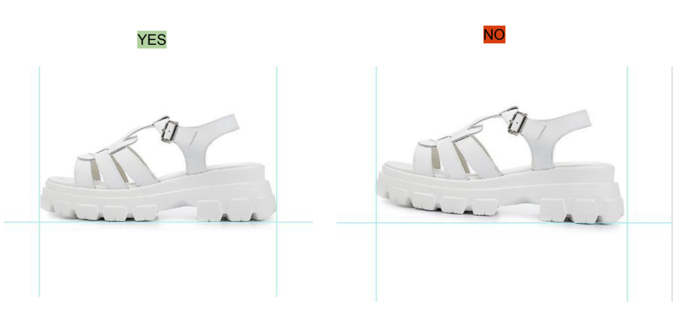
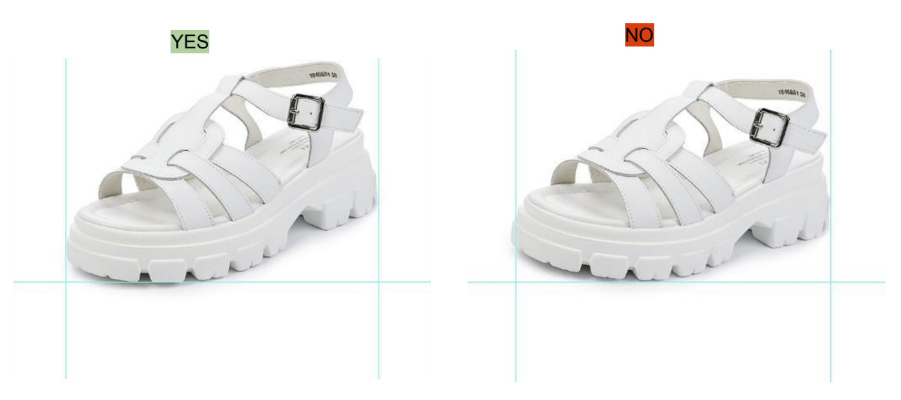
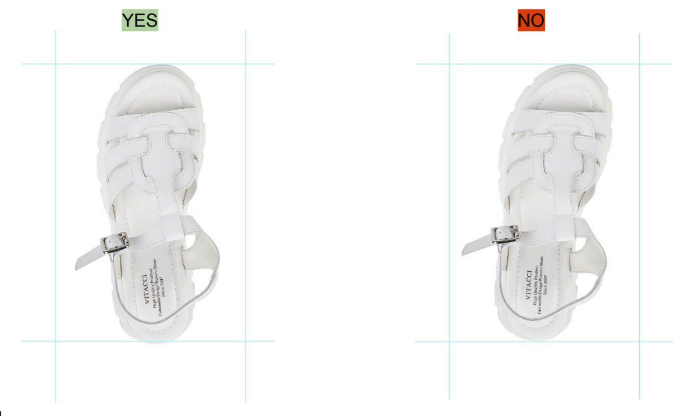
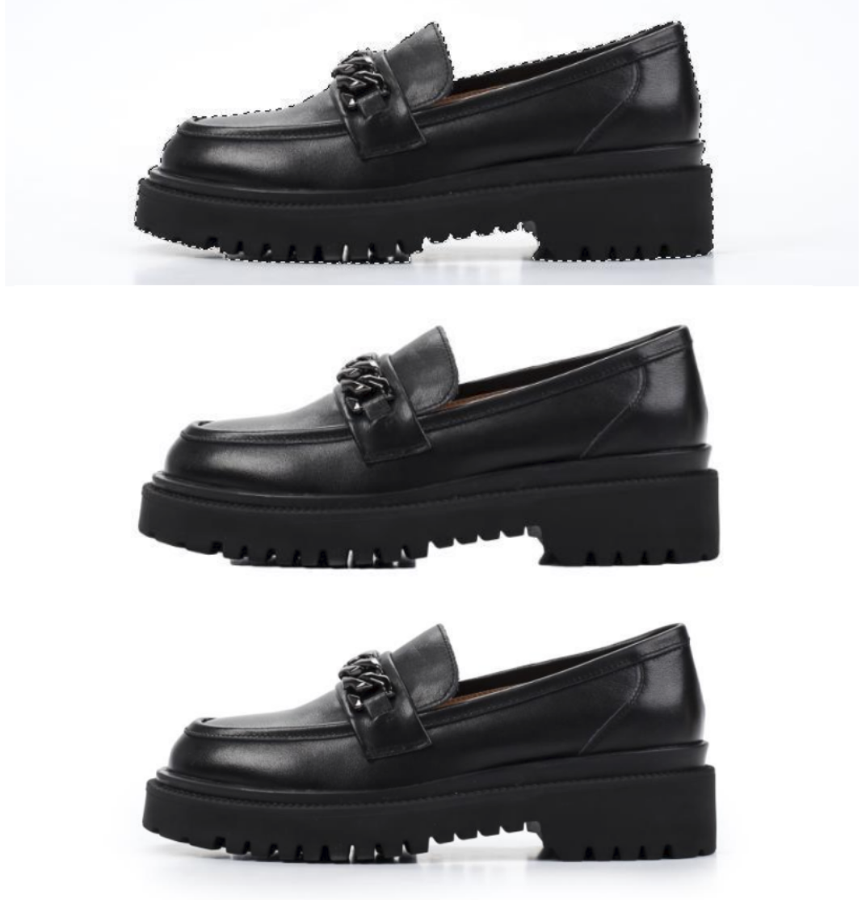
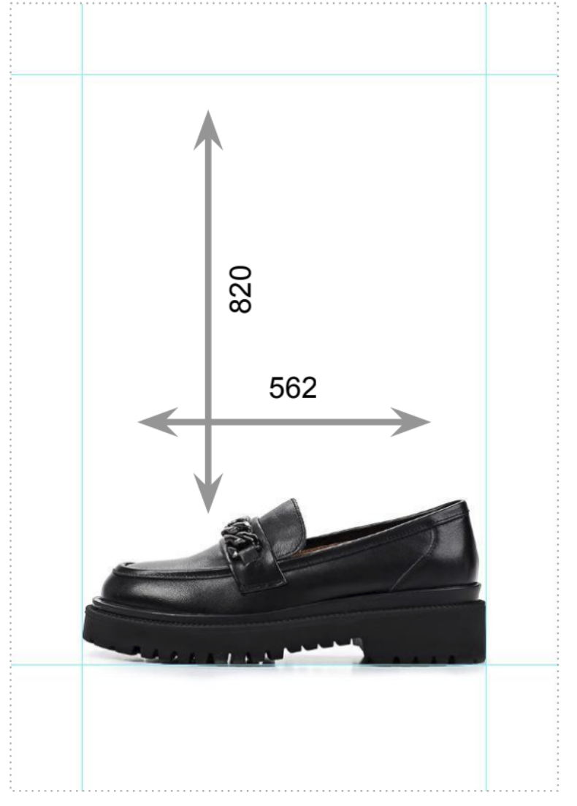
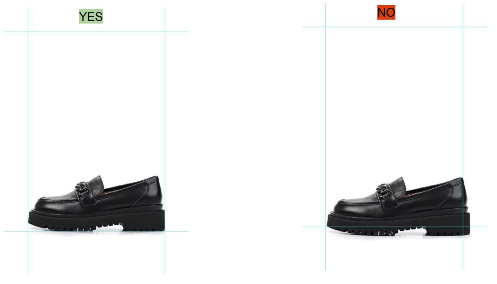
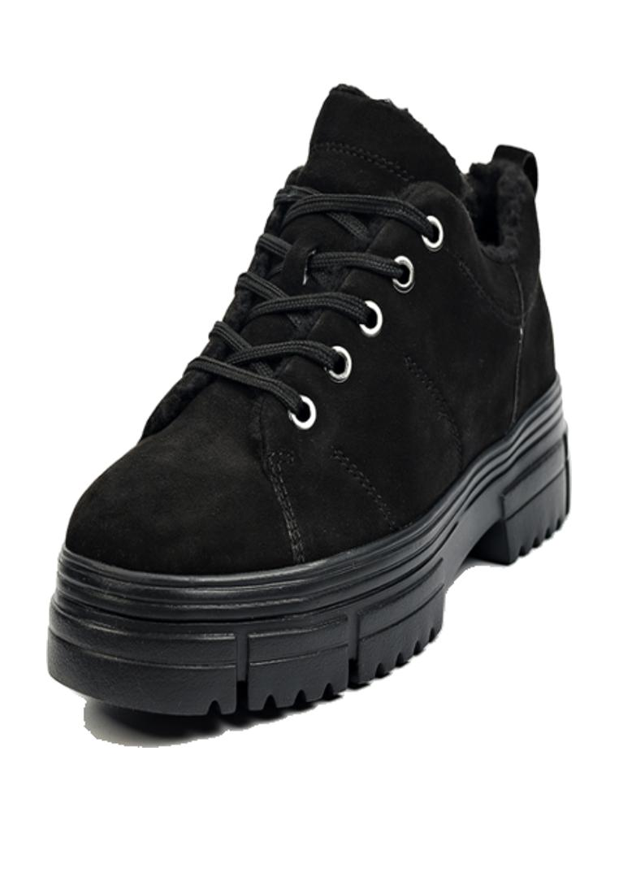
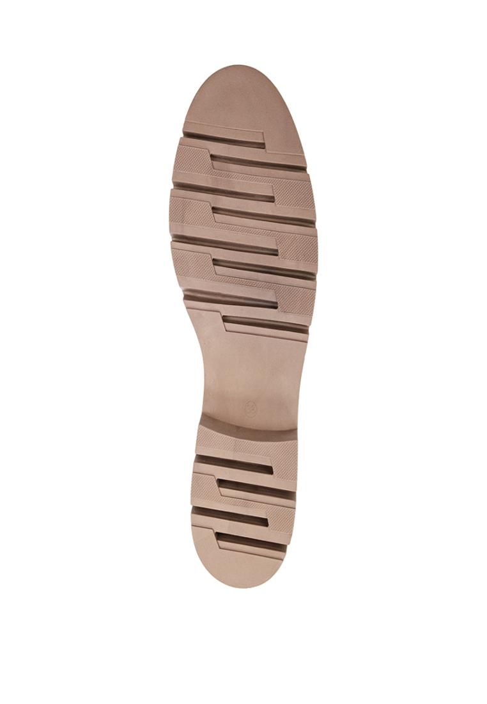
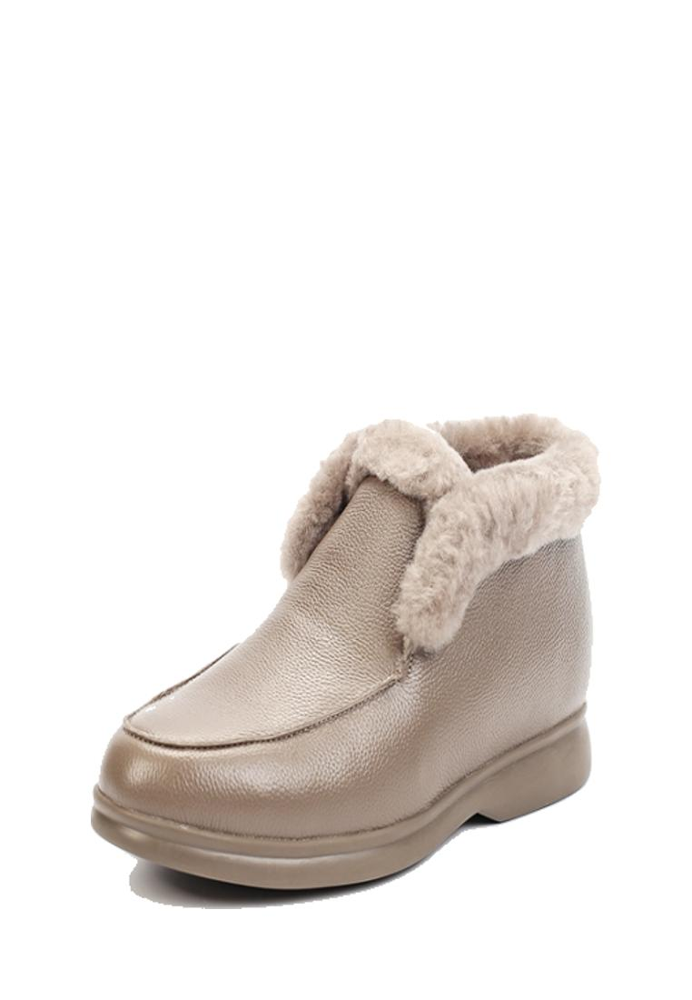
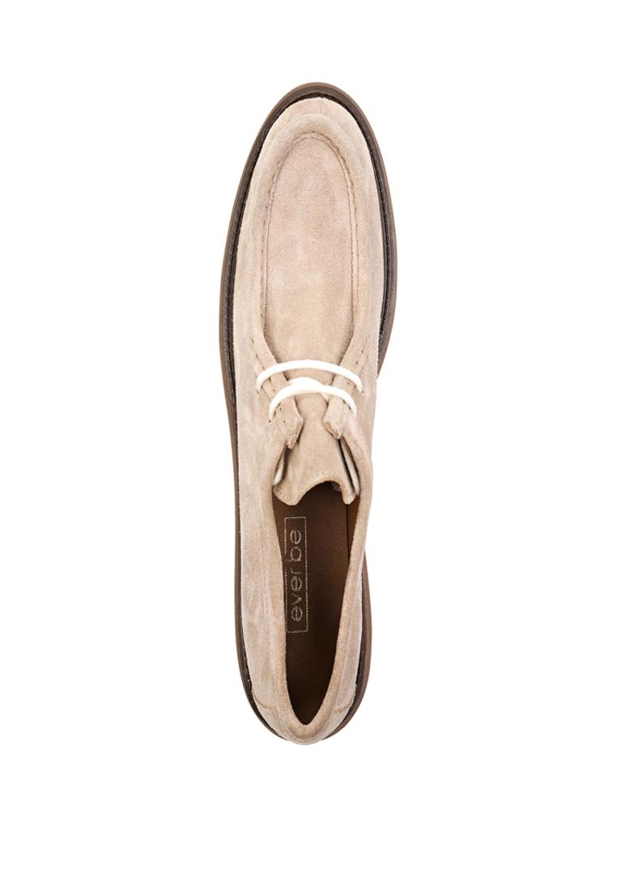

# Гайдлайн задачи

## Коррекция углов
### Для ориентации ракурс 1 (вид сбоку)

### Для ориентации ракурс 2 (3/4)

### Для ориентации ракурс 3 (вид сверху)

## Коррекция фона

## Постановка на линейки

### Пример постановки

# Моё решение
## Корекция углов
Было реализованно с помощью нейросети предсказывающей угол поворота на основе Resnet50.
## Коррекция фона
Сегментация сделана с помощью нейросети на основе Unet. Тень создаётся следующим образом:
1)Берётся фон вблизи сегментированного изображения
2)С этого фона добавляются все пиксели темнее определённого порога
Гораздо эффективнее было бы использовать предобученную модель для вырезания тени, однако это показалось мне слишком скучным, хотелось поработать с морфологическими операциями своими руками и придумать что-то своё

## Постановка на линейки
Было реализованно с помощью базовых морфологических операций. Берётся фото, ставится на белый фон, создаётся bounding box и добавляется на белый фон с правильными пропорциями.

## Пример работы

